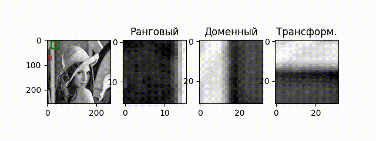

# Фрактальное сжатие

Фрактальное сжатие — алгоритм сжатия изображений с потерями, основанный на поиске самоподобия в изображениях.

Это небыстрый алгоритм, но он позволяет получать отличные результаты в терминах размера сжатого изображения.

Максимально сжатое цветное изображение занимает всего 2 кб, но сохраняет основные черты.


## Визуализация поиска блоков. 

Для каждого рангового (красного) блока найдем доменный (зеленый блок). Если найденный блок слишком плохой, окрасим его в соответствующий цвет.

[](images/simple_transforms.mp4)

## Запуск

Довольно хороший способ работать с ноутбуками заключается в том, чтобы не работать с ними. Ноутбуки очень объемные, они не позволяют удобно работать с `VCS` и линтерами. Поэтому я использую конвертер `.ipynb` в `.py`.

```
ipynb-py-convert fractal-compression.ipynb fractal-compression.py

ipynb-py-convert fractal-compression.py fractal-compression.ipynb
```
