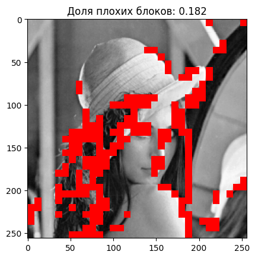

# Фрактальное сжатие

Фрактальное сжатие — алгоритм сжатия изображений с потерями, основанный на поиске самоподобия в изображениях.

Это небыстрый алгоритм, но он позволяет получать отличные результаты в терминах размера сжатого изображения.

Максимально сжатое цветное изображение (слева) занимает всего 2 кб, но сохраняет основные черты.


## Поиск блоков

Для каждого рангового (красного) блока найдем доменный (зеленый блок) и сохраним трансформацию, переводящую один в другой.


## Квадродерево

Для некоторых блоков (отмечены красным) мы нашли недостаточно хорошие трансформации.



Разделим каждый такой блок на четыре части и проведем дополнительный поиск для каждой части.

## Цветное изображение

Для сжатия цветного изображения перейдем в цветовое пространство `YCbCr` и будем кодировать каждый компонент отдельно.

Самый левый компонент — тон, два других — цветовые компоненты. 


Можно показать, что цветовые компоненты не так важны и поэтому могут быть сжаты сильнее без существенной потери качества.

## Процесс декомпрессии

Процесс декомпрессии состоит в применении трансформаций блоков к любому начальному изображению. 
При этом если применить серию трансформаций несколько раз, в качестве начального изображения используя результат 
предыдущего применения, то мы получим значительное улучшение результата.


Так выглядит результат разжатия цветного изображения при среднем качестве.


## Запуск

Довольно хороший способ работать с ноутбуками заключается в том, чтобы не работать с ними. Ноутбуки очень объемные, они не позволяют удобно работать с `VCS` и линтерами. Поэтому я использую конвертер `.ipynb` в `.py`.

```
ipynb-py-convert fractal-compression.ipynb fractal-compression.py

ipynb-py-convert fractal-compression.py fractal-compression.ipynb
```
